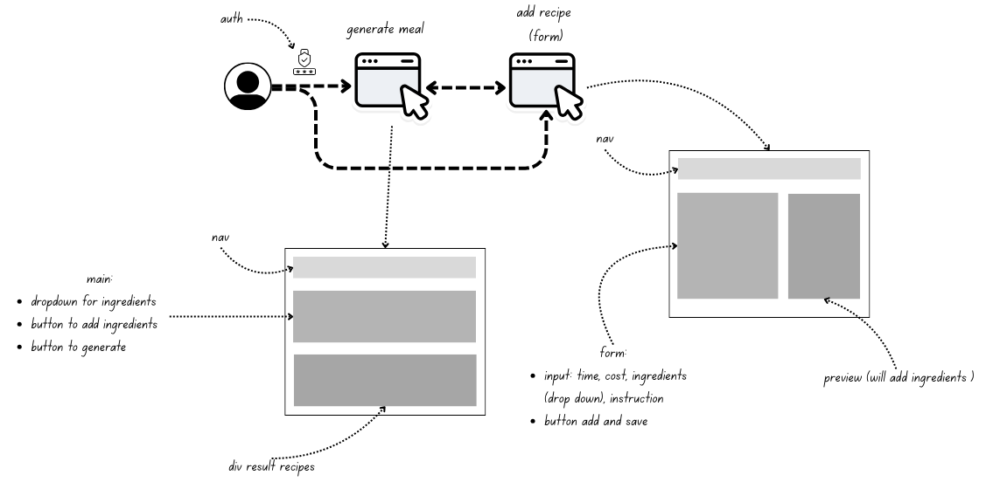
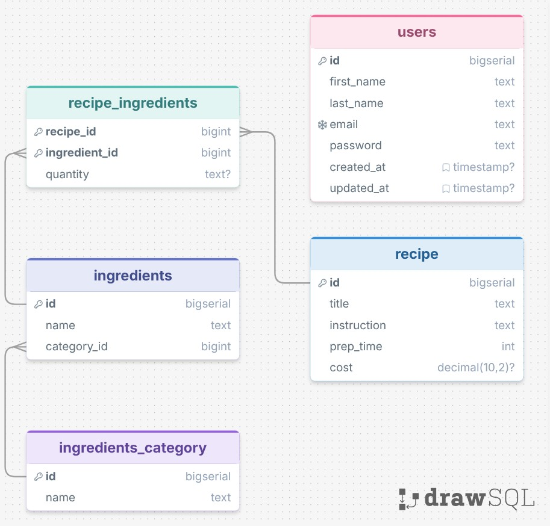
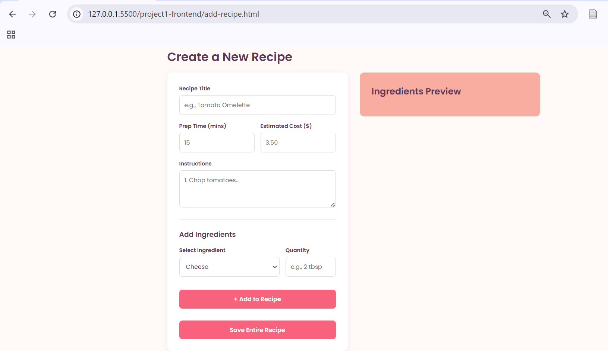

# GINFV25

# MealGenie Project Documentation

## 1. Overview

MealGenie is a web application that allows users to find recipes based on the ingredients they have in their kitchen. Especially, for students who have random ingredients in their fridge and want to get rid of it. It also provides functionality to register, log in, and contribute new recipes to the platform.

The project is structured into two main parts:

- **project1-backend**: A Node.js and REST API connecting to a PostgreSQL database.
- **project1-frontend**: A vanilla HTML, CSS, and JavaScript frontend.

-**draft thought process + template**
.

---

## 2. Technology Stack

- **Frontend**: HTML, CSS, JavaScript (Vanilla)
- **Backend**: Node.js, Express.js
- **Database**: PostgreSQL
- **Authentication**: JSON Web Tokens (JWT), bcrypt for password hashing

---

## 3. Database Schema

.

The PostgreSQL database consists of the following tables:

- **`users`**: Stores user account information (id, first_name, last_name, email, password, timestamps).
- **`ingredients_category`**: Categories for ingredients like 'Fruit', 'Meat', etc. (id, name).
- **`ingredients`**: Lookup table for ingredient types (id, name, category_id).
- **`recipe`**: Core recipe details (id, title, instruction, prep_time, cost).
- **`recipe_ingredients`**: A many-to-many join table mapping recipes to required ingredients along with the quantity needed (recipe_id, ingredient_id, quantity).
- **`favorites`**: A join table allowing users to save their favorite recipes (user_id, recipe_id).

---

## 4. Backend API Endpoints (Base URL: `http://localhost:3000/api`)

### Auth (`/api/auth`)

- `POST /register`: Register a new user. Expects `first_name`, `last_name`, `email`, `password` in body.
- `POST /login`: Authenticate a user and receive a JWT. Expects `email`, `password` in body.

### Ingredients (`/api/ingredient`)

- `GET /`: Fetch all ingredients, grouped or sorted based on the model query.

### Recipes (`/api/recipe`)

- `POST /generate`: Identify matching recipes based on an array of provided ingredients.
  - **Body:** `{ "ingredient_id": [1, 2, 3] }`
- `POST /`: Add a new recipe to the database. **Requires JWT Header (`Authorization: Bearer <token>`)**.
  - **Body:** `{ "title", "prep_time", "cost", "instruction", "ingredients": [ { "id", "quantity" } ] }`
- `GET /:id/detail`: Get specific details and exact ingredient quantities for a given recipe.

---

## 5. Frontend Application Structure

The frontend is a lightweight vanilla JS application located in the `project1-frontend` directory.

### Key Files & Views:

- **Authentication (`auth.html` & `auth.js`)**:
  - Handles user login and registration utilizing a toggleable UI view.
  - On successful login, securely stores the generated JWT to `localStorage` for authorized actions.
- **Meal Generation (`meal-generator.html` & `generator.js`)**:
  - The core interactive page.
  - Queries `GET /api/ingredient` to load available ingredients into a grouped dropdown.
  - Allows users to construct a "kitchen" list by selecting multiple ingredients.
  - Submits selected IDs to `POST /api/recipe/generate` and renders matched recipe results dynamically.
- **Recipe Creation (`add-recipe.html` & `add-recipe.js`)**:
  - A form interface allowing authenticated users to document new meals.
  - Collects metadata (title, time, cost, instructions) alongside dynamic ingredient quantities.
  - Appends the JWT locally saved token to headers and posts payloads to `POST /api/recipe`.
- **Navigation & Styling**:
  - `nav.js`: Contains common navigation scripts, covering token removal on logout.
  - `style.css`: Uses unified CSS variables for color styling (Peach, Coral, Plum motifs), managing layout components through Flexbox/CSS-Grid for responsiveness.

  ###

---

## 6. Demo Video

.

<video src="https://github.com/CheaRitheavatey/GINFV25/raw/main/IMG_7023.mp4" controls="controls" muted="muted" style="max-height:640px; min-height: 200px">
  Your browser does not support the video tag.
</video>

**Note: if unable to setup locally, please refer to the above video for a demonstration of the application's functionality.**

## 7. Setup & Running Locally

### 7.1 Database Initialization

1.  Ensure you have PostgreSQL installed and running.
2.  Use the provided schema script in `project1-backend/drawSQL-pgsql-export-2026-03-31.sql` to generate the schema and run data insertions.

### 7.2 Backend Setup

1.  Navigate into `project1-backend`. (`cd project1-backend`)
2.  Run `npm install` to resolve dependencies.
3.  Set up an `.env` file declaring necessary environment variables (e.g., `PORT=3000`, database connection logic, and a `JWT_SECRET` for token signing).
4.  Launch the Express server utilizing `node server.js` (or `nodemon server.js`).

### 7.3 Frontend Setup

1.  Navigate into `project1-frontend`.
2.  Access the web application navigating to the hosted port (suggestion start with auth.html`).
